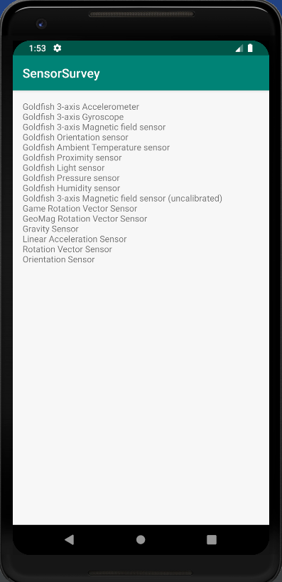
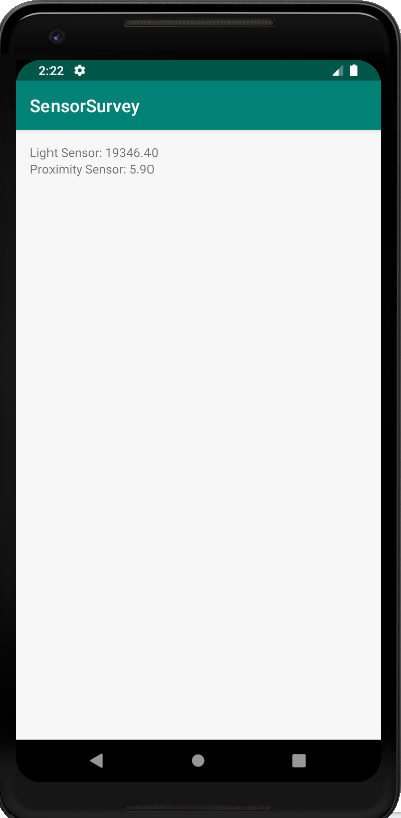
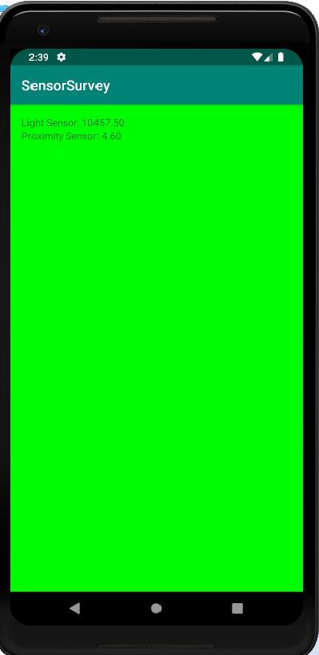
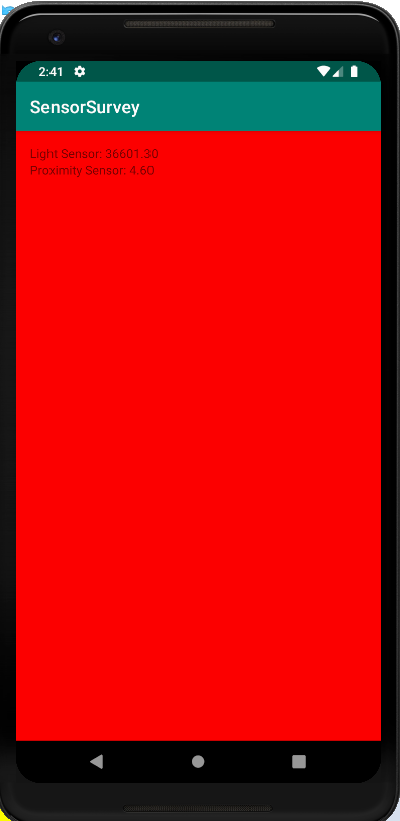
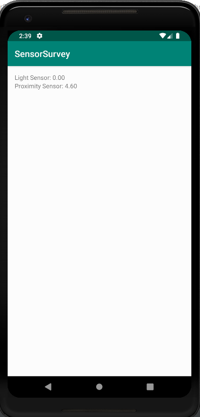
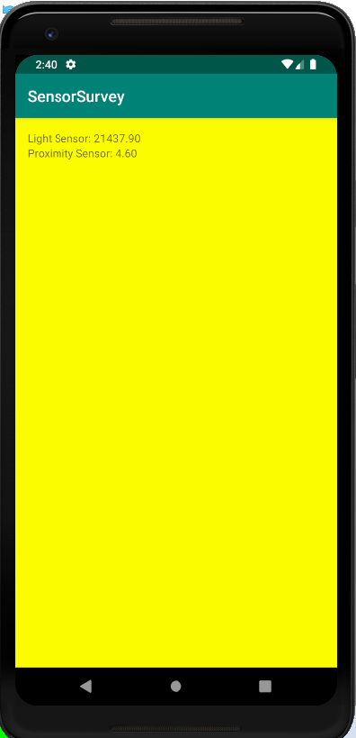
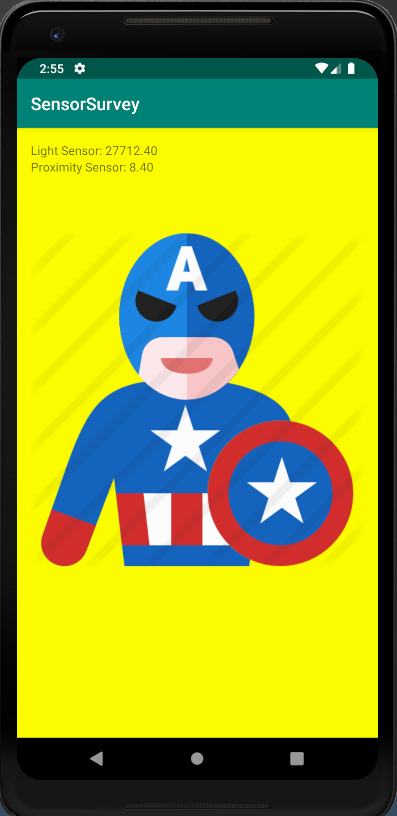

# GettingSensorData-Codelab
Getting Sensor Data Overview

Overview file is attached as a word file: GettingSensorDataOverview.docx

Instructions:

- Run the Android project.
- Create a new Virtual Device if not already. Then, choose Pixel 2 XL, then click OK.
- It will load the the sensor data.

